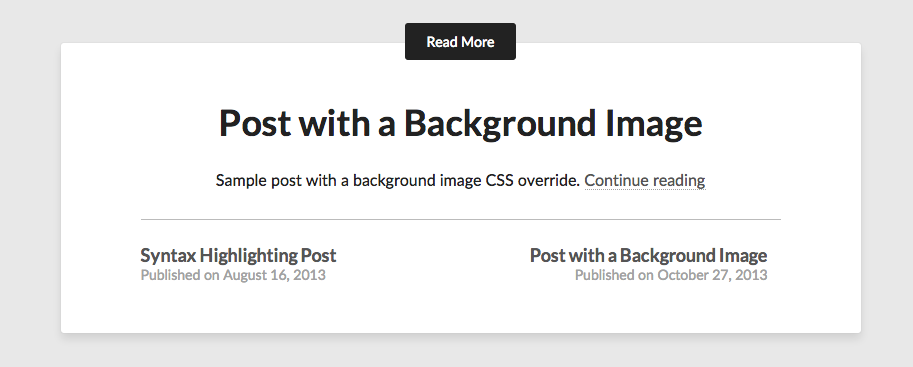

# Grav RelatedPages Plugin

`RelatedPages` is a [Grav](http://github.com/getgrav/grav) plugin that calculates related pages for the current page. It uses a highly configurable set of options to determine a **score** for each page you configure it to look at and compare.

It has 4 main calculation options that may be combined to produce very accurate results:

* Explicit page references in the header of a given page
* Taxonomy to Taxonomy matching.  i.e. comparing the number of matching tags in other pages
* Taxonomy to Content matching.  i.e counting the number of times a tag is in other page content
* Content to Content matching.  A comparison of the content between current and other pages

You can configure which combination of methods to use, customize the scoring, adjust how many related pages to show, cut-off scores and more!



# Installation

Installing the RelatedPages plugin can be done in one of two ways. Our GPM (Grav Package Manager) installation method enables you to quickly and easily install the plugin with a simple terminal command, while the manual method enables you to do so via a zip file.

## GPM Installation (Preferred)

The simplest way to install this plugin is via the [Grav Package Manager (GPM)](http://learn.getgrav.org/advanced/grav-gpm) through your system's Terminal (also called the command line).  From the root of your Grav install type:

    bin/gpm install relatedpages

This will install the RelatedPages plugin into your `/user/plugins` directory within Grav. Its files can be found under `/your/site/grav/user/plugins/relatedpages`.

## Manual Installation

To install this plugin, just download the zip version of this repository and unzip it under `/your/site/grav/user/plugins`. Then, rename the folder to `relatedpages`. You can find these files either on [GitHub](https://github.com/getgrav/grav-plugin-relatedpages) or via [GetGrav.org](http://getgrav.org/downloads/plugins#extras).

You should now have all the plugin files under

    /your/site/grav/user/plugins/relatedpages

# Usage

The default configuration provided in the `user/plugins/relatedpages.yaml` file contains sensible defaults:

```
enabled: true                   # set to false to disable this plugin completely
limit: 5                        # the number of related pages to display
show_score: true                # toggle to determine if scores should be displayed in output
score_threshold: 20             # minimum score needed to show up in the list
filter:                         # filter a configurable collection of pages to compare
    items:
        @page: /blog            # supports @self, @page, and @taxonomy collections
    order:
        by: date                # order type by default
        dir: desc               # order direction
page_in_filter: true            # true if the current page must be in the filtered collection
explicit_pages:
    process: true               # true|flase to enable this explicit page matching
    score: 100                  # score (0 - 100) to give explicit pages
taxonomy_match:                 # taxonomy type matching
    taxonomy: tag               # which taxonomy type to use
    taxonomy_taxonomy:
        process: true           # true|false to enable taxonomy to taxonomy matching
        score_scale:            # scores for number of matches
            1: 50
            2: 75
            3: 100
    taxonomy_content:
        process: true           # true|false to enable taxonomy to content matching
        score_scale:            # scores for number of matches
            1: 20
            2: 30
            3: 45
            4: 60
            5: 70
            6: 80
            7: 90
            8: 100
content_match:
    process: true               # true|false to enable content to content matching
```

To make your own modifications to the configuration options, you should copy the `user/plugins/relatedpages/relatedpages.yaml` file into a file: `user/config/plugins/relatedpages.yaml`.  Then if you wish to modify a particular setting you should copy the whole node and modify it, for example:

```
explicit_pages:
    process: true               # true|flase to enable this explicit page matching
    score: 75                   # score (0 - 100) to give explicit pages
```

# Display a List of Related Pages

To display a list of related pages, you need to reference the provided `relatedpages.html.twig` or provide your own modified version in your theme, and reference that.  For example:

```

    <h4>Related Posts</h4>
    

```

This will ensure that the `relatedpages` plugin is installed and enabled, and also that there are some related pages before including the template to render them.

